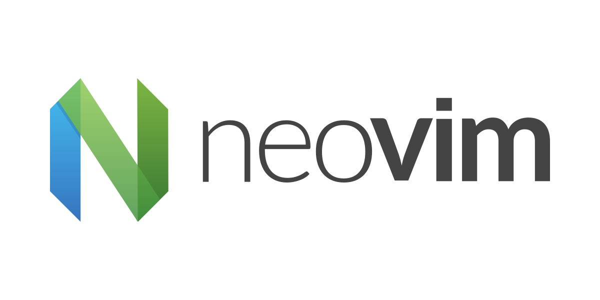

# Dotfiles & Tools

Hello, I am Sage, a Software Engineering student. <br>
In this repo, I organize all of my MacOS configurations and share the tools and workflows that might fit you as a developer!

## Table of Contents


<!--toc:start-->
- [Dotfiles & Tools](#dotfiles-tools)
  - [Table of Contents](#table-of-contents)
  - [Disclaimers](#disclaimers)
    - [Homebrew](#homebrew)
    - [Alacritty](#alacritty)
    - [Zsh](#zsh)
    - [Nvim](#nvim)
      - [General UI](#general-ui)
      - [Navigation](#navigation)
      - [LSP & Related](#lsp-related)
      - [Git Integration](#git-integration)
      - [Utilities and Text manipulation](#utilities-and-text-manipulation)
      - [Completion Engines](#completion-engines)
      - [Testing & Debugging](#testing-debugging)
      - [Web development essentials](#web-development-essentials)
      - [Integrations & Miscellanious](#integrations-miscellanious)
    - [Tmux](#tmux)
    - [Yabai](#yabai)
    - [SKHD](#skhd)
    - [Sketchybar](#sketchybar)
      - [Enabling/Disabling SIP (System Integrity Protection)](#enablingdisabling-sip-system-integrity-protection)
    - [Alfred](#alfred)
    - [SpaceLauncher](#spacelauncher)
    - [Git](#git)
<!--toc:end-->

  For any questions regarding the configurations feel free to open an [issue](https://github.com/JustSage/public-dotfiles/issues/new).

---
## Disclaimers

- This repo contains years of experience of my personal workflow, it may not suit your personal needs but feel free to grab whatever is useful to you.
- Linux or Windows users please note - some features may not work for you / require some additional setup / break your machine.
- In case something happens to your machine because of an application mentioned here - head over to their repository and file an issue on the topic.
- I do not claim any responsibility if these application cause harm to your computer, these applications are maintained by other developers.

<!-- ### Quickstart - NOT TESTED YET -->
<!---->
<!-- <details> -->
<!-- <summary>Bootstrap is yet tested, use at your own risk.</summary> -->
<!---->
<!-- [Bootstrap script](https://github.com/SageBaram/dotfiles/blob/master/workspace/self/scripts/.cfg-install.sh) included. Please read the script carefully to understand what software you are installing. -->
<!---->
<!-- > ##### TLDR (Bootstrap explained): -->
<!---->
<!-- > - **SAFE ON FRESH INSTALL**.<br> -->
<!---->
<!-- > - Backing up existing bare repository folder `.cfg` or creating one and setting git with the work tree parameters and checkout to set a bare repository for the dotfiles.<br> -->
<!---->
<!-- > - Installing Brew and Zshell.<br> -->
<!---->
<!-- > - Installing Brew dependencies **(which I use in my workflow, it may clash with either existing applications or conflicting dependencies)**.<BR> -->
<!---->
<!-- > - Installing Starship prompt.<br> -->
<!---->
<!-- > - Installing Packer.nvim plugin manager.<br> -->
<!---->
<!-- > - Removing existing `packer_compiled.lua` and syncing all plugins with `PackerSync`.<br> -->
<!---->
<!-- ##### Installation with Bootstrap script -->
<!---->
<!-- - Clone the repostitory via SSH or HTTPS, cd to the location of the repo and navigate to `./workspace/self/scripts` where the boostrap file is located.<br> -->
<!-- - Make the script executable with chmod and run the script. -->
<!---->
<!-- ```bash -->
<!-- git clone https://github.com/SageBaram/dotfiles.git -->
<!---->
<!-- cd path/to/repo/workspace/self/scripts -->
<!---->
<!-- chmod +x .cfg-install -->
<!---->
<!-- ./cfg-install -->
<!-- ``` -->
<!-- </details> -->

### Homebrew

Homebrew a package manager for MacOS. It makes downloading, installing, and version managing of small cli programs & enterprise applications a breeze.

- Install it on your machine:

  ```bash
  /bin/bash -c "$(curl -fsSL https://raw.githubusercontent.com/Homebrew/install/HEAD/install.sh)"
  ```

- Install packages with `brew install <package-name>`.
- Install applications with `brew --cask install <application-name>`.
- Use `brew --help` for more useful commands and info.

---
### Alacritty

Alacritty is a modern terminal emulator allowing extensive configuration, supporting BSD, Linux, MacOS and Windows.
It is fast, snappy, and has better UI/Keymap options compare to other terminal emulators I have used.

```bash
brew install alacritty
```

Check out the [repository](https://github.com/alacritty/alacritty) for [sane defaults](https://github.com/alacritty/alacritty/blob/master/alacritty.yml) and more info.

---
### Zsh


My shell of choice, superior to bash due to it's ease of use and extensiblility (IMO).

>**NOTICE**<br>

> Don't be tempted to install `oh-my-zsh (z shell)`/`oh-my-fish(fish shell)`/`oh-my-posh(power shell)`.<br>
They are extremely bloated frameworks and will most likely hinder your experience.<br>

Instead you should browse their [repository](https://github.com/ohmyzsh/ohmyzsh/wiki/Plugins) and scrape for specific plugins that are relevant to your workflow.<br>
You can copy the `.zsh` file contents and source it in your `.zshrc` the shell run-command file.

Some of the plugins I use extensively are [Fzf](https://github.com/junegunn/fzf), a general purpose fuzzy finder while in terminal buffers.<br>
Zsh [syntax-highlighting](https://github.com/zsh-users/zsh-syntax-highlighting) and [autosuggestions](https://github.com/zsh-users/zsh-autosuggestions/), zsh [vi-mode](https://github.com/SageBaram/dotfiles/blob/master/.config/zsh/vi-mode.zsh) for vi keybinds in the terminal, [Z](https://github.com/agkozak/zsh-z) for quick & seamless navigation to directories.<br>
You may use a full fledged [zsh-vi-mode](https://github.com/jeffreytse/zsh-vi-mode) but personally I think it's an overkill.

Highly recommend looking into [XDG Base Directory](https://wiki.archlinux.org/title/XDG_Base_Directory) to declutter your home directory,
and set up a `.zshenv` file to store PATH variables, environment variables & API Keys.

**For example:**

```bash
# XDG Path Settings
export XDG_DATA_HOME="$HOME/.local/share"
export XDG_CONFIG_HOME="$HOME/.config"
export XDG_CACHE_HOME="$HOME/.cache"
export XDG_STATE_HOME="$HOME/.local/state"

# Defaults
export DOTFILES="$XDG_CONFIG_HOME"
export ZDOTDIR="$XDG_CONFIG_HOME"/zsh
...

# Path vars
export PATH="$XDG_CONFIG_HOME/yarn/global/node_modules/bin:$PATH"
...

```


---
### Nvim



I've been using Vim/Neovim for quite a while now and this repo contains my maintained configurations.<br>

- Install via `brew install nvim` to install the latest stable version.
- Check out [neovim](https://github.com/neovim/neovim) for updates!


- [Packer](https://github.com/wbthomason/packer.nvim) - package manager, has lazyloading functionalities.

  Unix, Linux installation for packer (essential for all plugins mentioned bellow)

```bash
git clone --depth 1 https://github.com/wbthomason/packer.nvim\
~/.local/share/nvim/site/pack/packer/start/packer.nvim
```

Check out [my neovim configurations](https://github.com/SageBaram/dotfiles/tree/master/.config/nvim) or clone [the repository](https://github.com/SageBaram/dotfiles/archive/refs/heads/master.zip) and copy `nvim` folder to your `.config`.
Make sure to back up any previous configurations before doing so.

> Currently set up for python and web development.
> This setup is working on `Neovim 0.8.2`
> All plugins listed below do not require nighly version (development verion).

#### General UI

- [alpha](https://github.com/goolord/alpha-nvim) - dashboard on startup.
- [catppuccin](https://github.com/catppuccin/nvim) - colorscheme of choice.
- [lualine](https://github.com/nvim-lualine/lualine.nvim) - status line of choice.
- [indent-blankline](https://github.com/lukas-reineke/indent-blankline.nvim) - indent lines/dots to visually emphasis indentations.
- [todo-comments](https://github.com/folke/todo-comments.nvim) - provides highlighting to keywords like TODO,NOTE,FIX etc.
- [toggle-term](https://github.com/akinsho/toggleterm.nvim) - opens a terminal instance in neovim.
- [treesitter](https://github.com/nvim-treesitter/nvim-treesitter) - provides better syntax highlighting, folding etc.
- [web-devicons](https://github.com/kyazdani42/nvim-web-devicons) - provides icons to statusline, nvimtree etc. <u>**requires nerd-font**</u>.

#### Navigation

- [nvim-tree](https://github.com/kyazdani42/nvim-tree.lua) - file explorer in tree view.
- [telescope.nvim](https://github.com/telescope.nvim) - fuzzy finder over lists. super useful, similar to fzf but far more extensible.<br>
 [extensions](https://github.com/nvim-telescope): 
	- [telescope-fzf-native](https://github.com/nvim-telescope/telescope-fzf-native.nvim) - provides fzf search functionalities.
	- [telescope-live-grep-args](https://github.com/nvim-telescope/telescope-live-grep-args.nvim) - allows to pass arguments to live grep.
- [tmux](https://github.com/aserowy/tmux.nvim) - tmux integration with neovim.
- [harpoon](https://github.com/ThePrimeagen/harpoon) - better mark system to switch between frequent files.
- [project.nvim](https://github.com/ahmedkhalf/project.nvim) - project management integrated with telescope.

#### LSP & Related

- [mason](https://github.com/williamboman/mason.nvim) - lsp,dap,linter,formatter installer. Mason has external API plugins for each installer:
  - [mason-lspconfig](https://github.com/williamboman/mason-lspconfig.nvim)
  - [mason-null-ls](https://github.com/jayp0521/mason-null-ls.nvim)
  - [mason-nvim-dap](https://github.com/jayp0521/mason-nvim-dap.nvim)
- [nvim-lspconfig](https://github.com/neovim/nvim-lspconfig) - for language server protocols.
- [null-ls](https://github.com/jose-elias-alvarez/null-ls.nvim) - used primarily for formatting/linting diagnostics, provides a lot more.
- [neodev](https://github.com/folke/neodev.nvim) - settings and configurations for lua lsp.
- [lspsaga](https://github.com/glepnir/lspsaga.nvim) - a frontend ui to lsp capabilities.
- [lspkind](https://github.com/onsails/lspkind-nvim) - provides icons/naming to different kinds of lsp completion sources.

#### Git Integration

- [fugitive](https://github.com/tpope/vim-fugitive) - git integration with vim.
- [rhubarb](https://github.com/tpope/vim-rhubarb) - github integration with vim.
- [gitsigns](https://github.com/lewis6991/gitsigns.nvim) - shows git changes in gutter.
- [diffview](https://github.com/sindrets/diffview.nvim) - git diff viewer of choice.

#### Utilities and Text manipulation

- [comment](https://github.com/numToStr/Comment.nvim) - comment line or block. filetype sensitive, can work with multisyntax files (vue/jsx etc).
- [neogen](https://github.com/danymat/neogen) - documentation engine.
- [matchup](https://github.com/andymass/vim-matchup) - easy traversal between opening/closing tags of any kind with `%`.
- [autopairs](https://github.com/windwp/nvim-autopairs) - pair brackets automatically.
- [nvim-ts-autotag](https://github.com/windwp/nvim-ts-autotag) - close/change html tags automatically.
- [surround](https://github.com/tpope/vim-surround) - manipulating opening/closing brackets/parens etc.
- [repeat](https://github.com/tpope/vim-repeat) - repeating `.` motion for surround.
- [undotree](https://github.com/mbbill/undotree) - visual tree of your undos.
- [trouble](https://github.com/folke/trouble.nvim) - pretty lists for diagnostics, references, telescope results, quickfix and location lists.

#### Completion Engines

- [cmp](https://github.com/hrsh7th/nvim-cmp) - autocompletion engine.
  - [sources I use in the config](https://github.com/SageBaram/dotfiles/blob/046ba2cc8f48173643fb919b702043f570e5220c/.config/nvim/lua/plugins/init.lua#L127).
- [friendly-snippets](https://github.com/rafamadriz/friendly-snippets) - snippet engine support plugin.
- [luasnip](https://github.com/L3MON4D3/LuaSnip) - snippet engine.

#### Testing & Debugging

- [neotest](https://github.com/nvim-neotest/neotest) - connects different test adapters and provides a frontend for test environments.
- [nvim-dap](https://github.com/mfussenegger/nvim-dap) - debug adapter protocol, allows to attach debuggers to applications, set breakpoints etc.
- [nvim-dap-ui](https://github.com/rcarriga/nvim-dap-ui) - full fledged ui for debugging.

#### Web development essentials

- [nvim-colorizer](https://github.com/norcalli/nvim-colorizer.lua) - provides color highlighting for hex/rgb in text.
- [emmet-vim](https://github.com/mattn/emmet-vim) - emmet for html,css abbreviations.
- [markdown-preview](https://github.com/iamcco/markdown-preview.nvim) - markdown live-server.

#### Integrations & Miscellanious

- [impatient](https://github.com/lewis6991/impatient.nvim) - improved startuptime.
- [startuptime](https://github.com/dstein64/vim-startuptime) - show startuptime results graphically.
- [headlines](https://github.com/lukas-reineke/headlines.nvim) - markdown headlines for headers, dash, codeblocks etc.
- [presence](https://github.com/andweeb/presence.nvim) - shows a status of your neovim work in discord.


**NOTICE:**<br>
Check out the provided links before mindlessly using the configurations for further information about the plugins, any necessary dependencies it may require is listed in each repo.

If you are a beginner to Vim I strongly recommend using the built in tutor to get familiar with vim concepts.<br>
When in nvim use `:tutor`.

If you wish to understand the configurations or better, modify/extend them, learning basic `lua` is necessary.
There are many guides out there, but this covers most of what you need: [nvim-lua-guide](https://github.com/nanotee/nvim-lua-guide).


---
### Tmux

Terminal multiplexer, session manager, a tool any terminal user needs. Using multiple split panes, windows and sessions in a safe environment (supports session reload).

Install via `brew install tmux`.<br>
[Guide for tmux beginners](https://pragmaticpineapple.com/gentle-guide-to-get-started-with-tmux/), while there are plenty of guides out there this seems to be beginner friendly.

- Tmuxinator
  Co-pilot of tmux, instantiates predefined sessions with splits/panes/windows and more...
  Install via `brew install tmuxinator`.<br>

In order for vim and tmux work together please refer to the [Nvim](#nvim) section, install the tmux integration plugin and read through the documentation to enable
seamless pane switching, copy mode etc. Your `tmux.conf` file should contain these bindings in order for the integration to work :

There are other useful settings for vim in [tmux.conf](https://github.com/SageBaram/dotfiles/blob/master/.config/tmux/tmux.conf)
```bash
# Sets ctrl + h,j,k,l to move between panes with awareness of vim splits.
is_vim="ps -o state= -o comm= -t '#{pane_tty}' \
    | grep -iqE '^[^TXZ ]+ +(\\S+\\/)?g?(view|l?n?vim?x?)(diff)?$'"
bind -n 'C-h' if-shell "$is_vim" 'send-keys C-h' { if -F '#{pane_at_left}' '' 'select-pane -L' }
bind -n 'C-j' if-shell "$is_vim" 'send-keys C-j' { if -F '#{pane_at_bottom}' '' 'select-pane -D' }
bind -n 'C-k' if-shell "$is_vim" 'send-keys C-k' { if -F '#{pane_at_top}' '' 'select-pane -U' }
bind -n 'C-l' if-shell "$is_vim" 'send-keys C-l' { if -F '#{pane_at_right}' '' 'select-pane -R' }

# Sets ctrl + h,j,k,l for copy mode in tmux.
bind -T copy-mode-vi 'C-h' select-pane -L
bind -T copy-mode-vi 'C-j' select-pane -D
bind -T copy-mode-vi 'C-k' select-pane -U
bind -T copy-mode-vi 'C-l' select-pane -R
bind -T copy-mode-vi 'C-\' select-pane -l

# Resizing panes using alt/option key + h,j,k,l
bind -n 'M-h' if-shell "$is_vim" 'send-keys M-h' 'resize-pane -L 1'
bind -n 'M-j' if-shell "$is_vim" 'send-keys M-j' 'resize-pane -D 1'
bind -n 'M-k' if-shell "$is_vim" 'send-keys M-k' 'resize-pane -U 1'
bind -n 'M-l' if-shell "$is_vim" 'send-keys M-l' 'resize-pane -R 1'

# Resizing windows in copy mode.
bind -T copy-mode-vi M-h resize-pane -L 1
bind -T copy-mode-vi M-j resize-pane -D 1
bind -T copy-mode-vi M-k resize-pane -U 1
bind -T copy-mode-vi M-l resize-pane -R 1

# Copy mode visual selection and yank.
bind -T copy-mode-vi v send-keys -X begin-selection
bind -T copy-mode-vi y send-keys -X copy-selection
```

---
### Yabai

Tiling window manager in MacOS.
It's an extension to the built-in window manager of macOS.
With the combination of Mission Control and SKHD which enables to set user-defined
keyboard shortcuts. 

```bash
brew install koekeishiya/formulae/yabai
brew services start yabai
```

After updating the configuration you need to restart the service.
```bash
brew services restart yabai
```

Check out the [repository](https://github.com/koekeishiya/yabai).

### SKHD

A simple hotkey daemon for macOS which allows setting user-defined keyboard shortcuts
for macOS. You can set Yabai's shortcuts with it and much more.

```bash
brew install koekeishiya/formulae/skhd
brew services start skhd
```

After updating the configuration you need to restart the service.
```bash
brew services restart skhd
```

Check out the [repository](https://github.com/koekeishiya/skhd).

### Sketchybar

A dynamic programmable menu bar. You can add any existing menu bar items or create your own.
Using zsh/bash scripts I was able to customize the bar to fit my needs. 
Showing current active space I am on, current window title, spotify current active song, battery, date, time weather, and ram/cpu.

```bash
brew tap FelixKratz/formulae
brew install sketchybar

brew services start sketchybar
```

After updating the configuration you need to restart the service.
```bash
brew services restart sketchybar
```

Check out the [repository](https://github.com/FelixKratz/SketchyBar).

#### Enabling/Disabling SIP (System Integrity Protection)

System Integrity Protection (SIP) in macOS protects the entire system by preventing the execution of unauthorized code.
The system automatically authorizes apps that the user downloads from the App Store.
The system also authorizes apps that a developer notarizes and distributes directly to users.

*The system prevents the launching of all other apps by default.*
These apps are usually third party software such as Yabai, SKHD and Sketchybar.
My personal configuration require SIP to be disabled for it to fully work.

*Some features will not work with SIP enabled.*

[How to Disable/Enable SIP by Apple](https://developer.apple.com/documentation/security/disabling_and_enabling_system_integrity_protection)

---
### Alfred

Spotlight alternative. It's an incredible productivity tool!

[Alfred app](https://www.alfredapp.com/) - visit their website and try out the free version!

Alfred offers multiple features such as:

- Search & Browse (literally anything, anywhere).
- Intellisense-like suggestions for search.
- Automate tasks.
- Workflows.
- Snippets.
- Cliboard history.
- 1Password integration.
- System Commands.

This is an essential productivity tool I have to install right away on a mac.<br>
There is a paid version which is not mandatory but I highly recommend it to experience the full power of Alfred.


---
### SpaceLauncher

A macos application that allows spacebar modifications and launch software/simulate commands.<br>
Since I use a moonlander and my spacebar when held changes to a different layout, I use `,` as the prefix instead.

For example holding `,` -> `W` launches chrome or focuses chrome window if there is one available.<br>
It works really well with Yabai and highly recommended if you have a multi-monitor setup like myself.


Adding commands:<br>
You can use space or any other key code that will set as the prefix. Add a key like `W` (web).<br>
As for the action I use Open URL so it won't launch the application if it's on like so: `file:///Applications/Google%20Chrome.app/`.

To install it via brew:
```
brew install --cask spacelauncher
```

Check out their website for more information : [SpaceLauncher.com](https://spacelauncherapp.com/)

*For any other application please note, the triple slash is important for it to work & if there is a space between the name use `%20`.*

---
### Git

Version control for all purposes. Typed notes, software and configurations are all managed via git.

- Install via `brew install git`
- [commitizen/cz-cli](https://github.com/commitizen/cz-cli) - commit parser.
- [gitmux](https://github.com/arl/gitmux) - git info for tmux statusbar.

---
## For any questions regarding the configurations feel free to open an [issue](https://github.com/SageBaram/dotfiles/issues/new).
